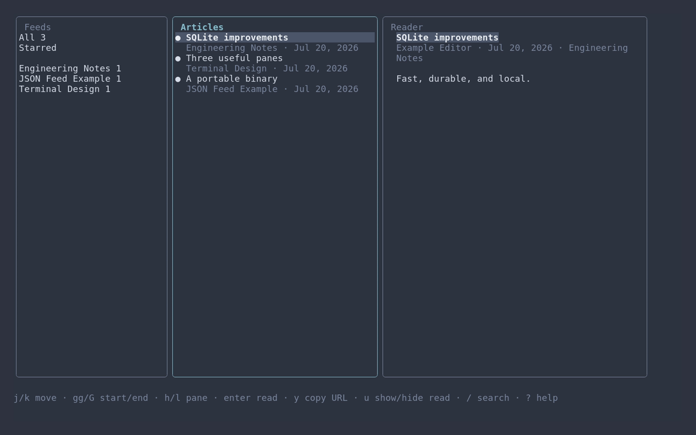
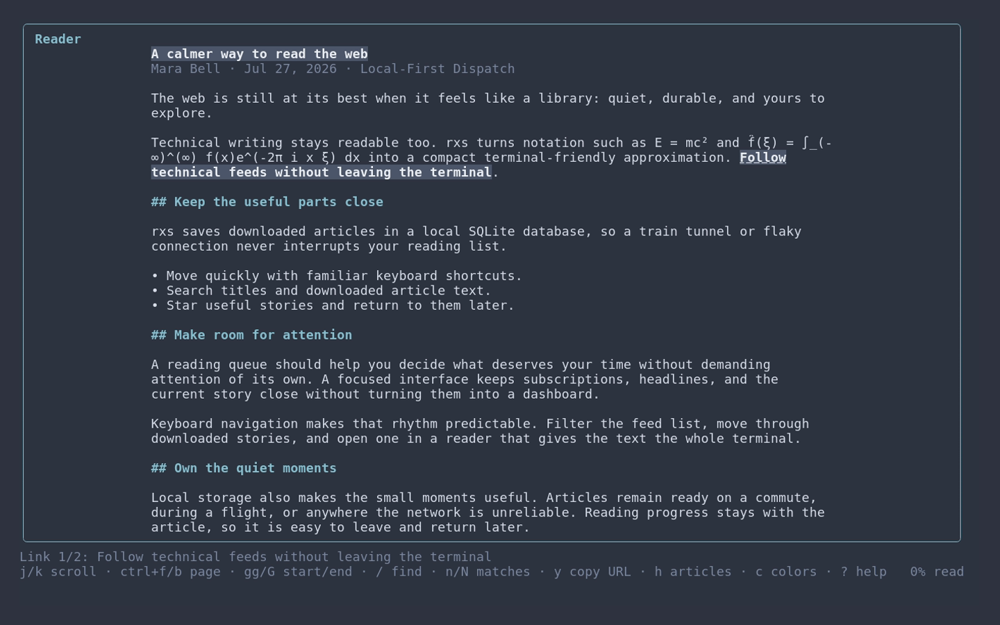

# rxs

`rxs` is a local-first, keyboard-driven RSS, Atom, and JSON Feed reader for the terminal. It stores downloaded articles in SQLite, starts without an account, and remains useful offline.

## Screenshots

Browse feeds, articles, and a reading preview side by side:



Open an article in the focused reader:



## Install

Go 1.26 or newer is required when building from source.

```sh
go install github.com/polera/rxs/cmd/rxs@latest
rxs
```

Precompiled binaries for Linux, macOS, and Windows on amd64 and arm64 are also
available from [GitHub Releases](https://github.com/polera/rxs/releases/latest).
Download the archive for your platform, extract `rxs` (`rxs.exe` on Windows),
and place it somewhere on your `PATH`. Each release includes `checksums.txt`
for verifying the download.

rxs checks GitHub Releases once a day when starting the interactive UI. If a
newer release is available, choose to install it or defer the prompt for 24
hours. To check and upgrade immediately, run:

```sh
rxs upgrade
```

Upgrades download the release archive for the current operating system and
architecture, verify it against the published SHA-256 checksum, and replace the
current executable.

For local development:

```sh
go build -o rxs ./cmd/rxs
./rxs
```

Feeds can also be added without opening the terminal interface. The command
fetches the feed immediately and stores its articles for offline reading:

```sh
rxs add https://example.com/feed.xml
```

The database lives in the platform user-data directory by default (`$XDG_DATA_HOME/rxs/rxs.db` or `~/.local/share/rxs/rxs.db` on Linux). Pass `-db PATH` to use a different database. No configuration file is required.

## Use

Press `a`, enter an HTTP or HTTPS feed URL, and press Enter. The feed is fetched immediately. Downloaded article text is searchable and available after the network goes away.

| Key | Action |
| --- | --- |
| `j` / `k`, arrows | Move in the active pane; scroll by line in the reader |
| `h` / `l` | Change pane |
| `ctrl+f` / `ctrl+b` | Page down / up in the feed list or reader |
| `ctrl+d` / `ctrl+u` | Half page down / up in the reader |
| `gg` / `G` | Go to the beginning / end of the active list or article |
| `/`, then `n` / `N` | Find in the open article; select the next / previous match |
| Tab / Shift-Tab | Change pane, or select the next / previous link in the reader |
| Enter | Open an article, or open the selected link |
| Space | Toggle read/unread |
| `s` | Toggle starred |
| `r` / `R` | Refresh selected feed / all feeds |
| `/` in feeds | Filter feeds by title or URL; submit an empty filter to clear |
| `/` in articles | Search downloaded titles and text; submit an empty search to clear |
| `u` | Show / hide read articles for this session |
| `a` / `d` | Add / remove a feed |
| `o` | Open the original article in the system browser |
| `i` / `e` | Import / export an OPML file |
| `c` | Preview and select a color scheme |
| `?` | Show help |
| `q` | Ask to quit, or close help and confirmation dialogs |
| Esc | Close an input dialog |

The layout adapts to the terminal: browsing shows all three panes when wide, feeds and articles at medium widths, and one pane on narrow terminals. Opening the reader collapses the feed and article panes at every width so the article uses the full terminal. An unread article is marked read when you reach its bottom and then press `h`, Left, or Shift-Tab (when no link is selected) to return to the article list.

### Reading configuration

Read articles are hidden from the article listing by default. Press `u` to
show them for the current session. To show read articles initially instead, add
this to `config.json`:

```json
{
  "reading": {
    "hide_read": false
  }
}
```

Article previews remain unread while you move through the article list by
default. To mark each preview read when you scroll away from it, add this to
`config.json`:

```json
{
  "reading": {
    "mark_read_on_scroll": true
  }
}
```

The setting applies to `j` / `k`, arrow keys, `gg`, and `G`. A jump marks only
the preview you leave, and movement clamped at a list boundary does not mark
anything.

### Browser configuration

Links and original articles open in the system browser by default. To use an interactive terminal browser, create `config.json` in the platform configuration directory (`$XDG_CONFIG_HOME/rxs/config.json` or `~/.config/rxs/config.json` on Linux):

```json
{
  "browser": {
    "mode": "tui",
    "command": "w3m",
    "args": ["{url}"]
  }
}
```

`command` is executed directly, without a shell. The article URL replaces `{url}` in an argument; if no argument contains `{url}`, it is appended. Use `-config PATH` for a different local configuration file. Set `"mode"` to `"system"` (or remove the file) to use the operating system browser.

### Color schemes

The terminal interface includes `default`, `dracula`, `gruvbox-dark`, `nord`,
`solarized-dark`, and `solarized-light`. Select one in the same `config.json`:

```json
{
  "appearance": {
    "color_scheme": "nord"
  }
}
```

Names are case-insensitive and surrounding whitespace is ignored. Missing
appearance configuration uses `default`, which preserves the original terminal
colors. Press `c` in the interface and use `j` / `k` (or the arrow keys) to
preview the built-in schemes live. Enter applies the choice and writes it to the
active configuration file; Esc restores the previous scheme. The foreground and
background are both set for named schemes so light schemes remain readable. Use
`-config PATH` to load and persist the setting in another file.

Refreshes use conditional HTTP requests when servers provide `ETag` or `Last-Modified`, enforce time and size limits, follow at most five redirects, and record per-feed errors without interrupting navigation. A bounded worker pool fetches feeds concurrently; SQLite writes are serialized and transactional.

## Develop

```sh
go test ./...
go test -race ./...
go vet ./...
```

Fixtures for RSS, Atom, and JSON Feed live in `testdata/feeds`. Database migrations are embedded from `internal/store/migrations`.

Release workflows build Linux, macOS, and Windows binaries for amd64 and arm64,
with CGO disabled.
