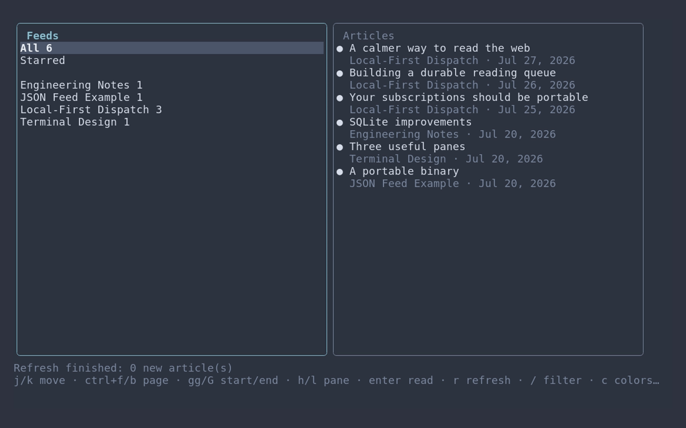
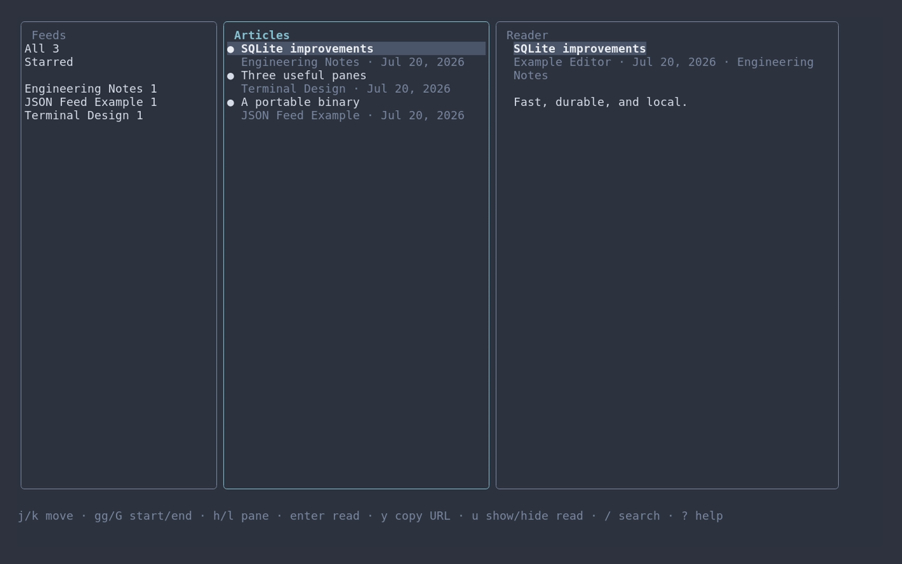
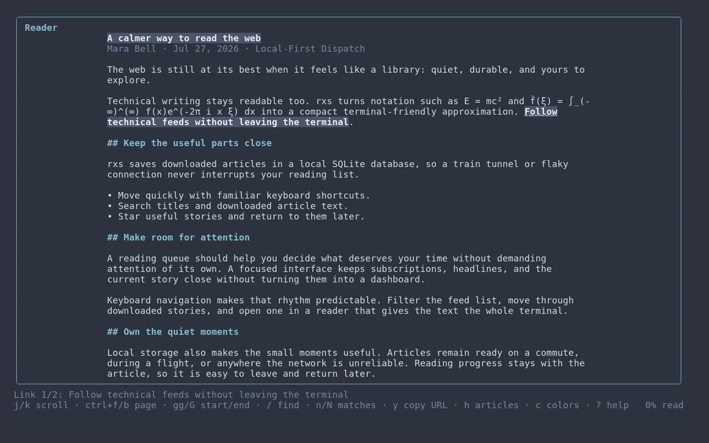

<h1 align="center">
  <picture>
    <source media="(prefers-color-scheme: dark)" srcset="assets/logo-full-dark.svg">
    <source media="(prefers-color-scheme: light)" srcset="assets/logo-full.svg">
    
  </picture>
</h1>

`rxs` is a lightweight TUI RSS reader supporting RSS, Atom, and JSON feeds.  Articles are 
stored in a local SQLite database.

## Screenshots

Navigate from the initial feed list through filtering, article selection, and the focused reader:



Browse feeds, articles, and a reading preview side by side:



Open an article in the focused reader:



## Install

Go 1.27 or newer is required when building from source.

```sh
go install github.com/polera/rxs/cmd/rxs@latest
rxs
```

Precompiled binaries for Linux, macOS, and FreeBSD on amd64 and arm64 are also
available from [GitHub Releases](https://github.com/polera/rxs/releases/latest).
Download the archive for your platform, extract `rxs`, and place it somewhere
on your `PATH`. Each release includes `checksums.txt`
for verifying the download.

rxs checks GitHub Releases once a day when starting the interactive UI. If a
newer release is available, choose to install it or defer the prompt for 24
hours. To check and upgrade immediately, run:

```sh
rxs upgrade
```

Upgrades download the release archive for the current operating system and
architecture, verify it against the published SHA-256 checksum, and replace the
current executable.

For local development:

```sh
go build -o rxs ./cmd/rxs
./rxs
```

Feeds can also be added without opening the terminal interface. The command
fetches the feed immediately and stores its articles for offline reading:

```sh
rxs add https://example.com/feed.xml
```

The database lives in the platform user-data directory by default (`$XDG_DATA_HOME/rxs/rxs.db` or `~/.local/share/rxs/rxs.db` on Linux and FreeBSD). Pass `-db PATH` to use a different database. No configuration file is required.

## Use

Press `a`, type or paste an HTTP or HTTPS feed URL with your terminal's paste
shortcut, and press Enter. 

- Downloaded article text is searchable offline. 
- LaTeX expressions in article text are detected automatically and shown with terminal-friendly Unicode
symbols.  Since this is a basic expression detection, unknown symbols will show as-is.


| Key | Action |
| --- | --- |
| `j` / `k`, arrows | Move in the active pane; scroll by line in the reader |
| `h` / `l` | Change pane |
| `ctrl+f` / `ctrl+b` | Page down / up in the feed list or reader |
| `ctrl+d` / `ctrl+u` | Half page down / up in the reader |
| `gg` / `G` | Go to the beginning / end of the active list or article |
| `/`, then `n` / `N` | Find in the open article; select the next / previous match |
| Tab / Shift-Tab | Change pane, or select the next / previous link in the reader |
| Enter | Open an article, or open the selected link |
| Space | Toggle read/unread |
| `s` | Toggle starred |
| `y` | Copy the selected article's URL to the clipboard |
| `r` / `R` | Refresh selected feed / all feeds |
| `/` in feeds | Filter feeds by title or URL; submit an empty filter to clear |
| `/` in articles | Search downloaded titles and text; submit an empty search to clear |
| `x` | Remove the active feed filter or article search (`Ctrl+x` from its input modal) |
| `u` | Show / hide read articles for this session |
| `a` / `d` | Add / remove a feed |
| `o` | Open the original article in the system browser |
| `i` / `e` | Import / export an OPML file |
| `c` | Preview and select a color scheme |
| `?` | Show help |
| `q` | Ask to quit, or close help and confirmation dialogs |
| Esc | Close an input dialog |

Copying uses the terminal's clipboard support. The terminal needs to allow
clipboard writes for `y` in order to update the system clipboard.

OPML export includes all saved subscriptions.

The layout adapts to the terminal: browsing shows all three panes when wide, feeds and articles at medium widths, and one pane on narrow terminals. Opening the reader collapses the feed and article panes at every width so the article uses the full terminal. An unread article is marked read when you reach its bottom and then press `h`, Left, or Shift-Tab (when no link is selected) to return to the article list.

Article lists and search results load in small pages as you move with `j` / `k`.
The arrows in the Articles pane title indicate when more pages are available.
`gg` and `G` jump to the newest and oldest matching articles across all pages.
Reader content is loaded when needed, so large libraries do not load every
article body into memory at startup.

rxs saves each article's reading position when you leave the reader or confirm
that you want to quit. Opening that article again resumes at the saved position,
even after restarting rxs or using a different terminal size.

Confirming quit waits for pending read, star, and reading-position writes. If a state
write fails while quitting, rxs stays open and reports the error instead of exiting.


### Reading configuration
When reopening rxs, you will automatically be returned to where you left off.  To disable this
functionality, add the following to `config.json`:

```json
{
  "reading": {
    "resume_last_view": false 
  }
}
```

Read articles are hidden from the article listing by default. Press `u` to
show them for the current session. To show read articles initially instead, add
this to `config.json`:

```json
{
  "reading": {
    "hide_read": false
  }
}
```

Article previews remain unread while you move through the article list by
default. To mark each preview read when you scroll away from it, add this to
`config.json`:

```json
{
  "reading": {
    "mark_read_on_scroll": true
  }
}
```

The setting applies to `j` / `k`, arrow keys, `gg`, and `G`. A jump marks only
the preview you leave, and movement clamped at a list boundary does not mark
anything.

### Full-article downloads

Full-article download  is off by default. To expand feed items that appear to
contain only a summary or truncation, enable automatic downloads in
`config.json`:

```json
{
  "content": {
    "full_articles": "auto"
  }
}
```


### Browser configuration

Links and original articles open in the system browser by default. To use an interactive terminal browser, create `config.json` in the platform configuration directory (`$XDG_CONFIG_HOME/rxs/config.json` or `~/.config/rxs/config.json` on Linux and FreeBSD):

```json
{
  "browser": {
    "mode": "tui",
    "command": "w3m",
    "args": ["{url}"]
  }
}
```

`command` is executed directly, without a shell. The article URL replaces `{url}` in an argument; if no argument contains `{url}`, it is appended. Use `-config PATH` for a different local configuration file. Set `"mode"` to `"system"` (or remove the file) to use the operating system browser.

### Color schemes

The terminal interface includes `default`, `catppuccin-latte`,
`catppuccin-mocha`, `dracula`, `gruvbox-dark`, `gruvbox-light`, `high-contrast`,
`nord`, `solarized-dark`, `solarized-light`, and `tokyo-night`. Select one in the
same `config.json`:

```json
{
  "appearance": {
    "color_scheme": "nord"
  }
}
```

Names are case-insensitive and surrounding whitespace is ignored. Missing
appearance configuration uses `default`, which preserves the original terminal
colors. Press `c` in the interface and use `j` / `k` (or the arrow keys) to
preview the built-in schemes live. Enter applies the choice and writes it to the
active configuration file; Esc restores the previous scheme. The foreground and
background are both set for named schemes so light schemes remain readable.
`catppuccin-latte`, `gruvbox-light`, and `solarized-light` suit light terminals;
`high-contrast` is a black-and-white scheme. Use
`-config PATH` to load and persist the setting in another file.

Refreshes use conditional HTTP requests when servers provide `ETag` or `Last-Modified`, enforce time and size limits, follow at most five redirects, and record per-feed errors without interrupting navigation. A bounded worker pool fetches feeds concurrently; SQLite writes are serialized and transactional. Full-article enrichment handles at most ten entries per feed refresh and also backfills eligible stored entries after a `304 Not Modified` response.

## Development

```sh
go test ./...
go test -race ./...
go vet ./...
make license-check
```

Fixtures for RSS, Atom, and JSON Feed live in `testdata/feeds`. Database migrations are embedded from `internal/store/migrations`.

`make install-tools` explicitly installs the versions pinned in `Makefile` into
version-specific `.tools/` directories. `make checks` then runs license, vet, race,
Staticcheck, OSV, and gosec checks without installing tools or using binaries from
`PATH`. These development tools are outside the application's module graph. OSV
results still depend on the current advisory database and network availability.

Use `make fuzz` for bounded parser fuzz runs and `make bench` for repeated benchmark
samples with allocation reporting. The full benchmark matrix includes 100,000-entry
storage stress cases and can take several minutes. See the
[rendering benchmarks](internal/render/BENCHMARKS.md) and
[storage performance notes](internal/store/PERFORMANCE.md) for focused commands,
profiling, local measurements, and their limitations.

CI runs tests, vet, race checks, bounded fuzzing, and license checks on Linux.

Release workflows build Linux, macOS, and FreeBSD binaries for amd64 and arm64 with
CGO disabled.

## License

rxs is released under the [MIT license](LICENSE).

Every declared dependency version has been reviewed as permissively licensed
and compatible with distributing rxs under MIT. The version-pinned review is
recorded in [`licenses/approved-modules.txt`](licenses/approved-modules.txt).
Running `make license-check` fails when `go.mod` and that policy differ.

Release archives ship a `THIRD_PARTY_LICENSES.txt` listing each linked module,
its reviewed SPDX license expression, and its complete module-level license and
notice files. To regenerate it locally:

```sh
make licenses
```

The set of linked modules differs by platform, so the file is generated per build
target from the compiled binary rather than checked in.
